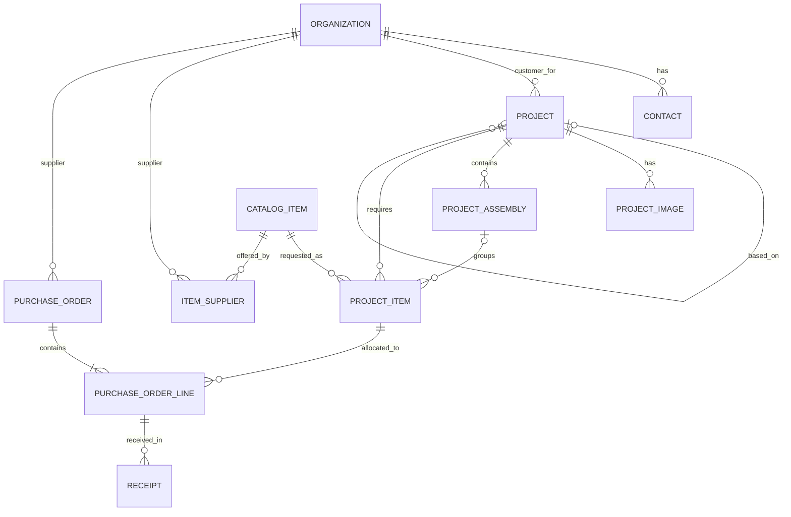

# Черновая модель предметной области EngFlow

Статус: текущая согласованная модель. Поля предварительные; нерешенные вопросы отмечены `TODO / Open Question`.

## 1. ER-диаграмма

Диаграмма не вводит сущности ролей, единиц измерения, файлового хранилища, склада, счетов, актов, писем или учета времени.

## 2. Project

**Назначение:** одна конструкция/установка по одной КД и одному заказу. Несколько физических экземпляров учитываются количеством.

Поля: `id`, `designation` (обязательное, уникальное), `name`, `modificationName`, `customer -> Organization`, `status`, `quantity`, `completionDate` (nullable), `description`, `basedOnProject -> Project` (nullable), `createdAt`, `updatedAt`.

Статусы: `DESIGN`, `PRODUCTION`, `COMPLETED`.

Связи:

- `Organization 1:N Project`: организация является заказчиком нескольких проектов; у проекта один заказчик.
- Самоссылка `Project 1:N Project`: исходный проект может быть основой нескольких новых; у нового проекта не более одного `basedOnProject`.
- `Project 1:N ProjectImage`, `ProjectAssembly`, `ProjectItem`.

Правила:

- Используется `modificationName`, не `modelName`.
- `completionDate` — фактическая дата завершения; до завершения равна `NULL`. Отдельное `plannedCompletionDate` пока не вводится.
- Год выводится из `completionDate` и отдельно не хранится.
- `designation` обязательно и уникально; жесткая валидация формата пока отсутствует.
- `basedOnProject` означает происхождение и возможное копирование; проекты не синхронизируются после создания. `PurchaseOrder`, `Receipt` и `completionDate` динамически не наследуются.

`TODO / Open Question`: обязательность заказчика, нормализация обозначения, ограничения количества и точный состав копируемых данных.

## 3. ProjectImage

**Назначение:** метаданные фотографии проекта.

Поля: `id`, `project -> Project`, `originalFileName`, `storageName`, `description`, `isPrimary`, `sortOrder`.

Связь: `Project 1:N ProjectImage`; фотография принадлежит одному проекту.

Правила: изображение не хранится в PostgreSQL как BLOB; `storageName` является идентификатором/путем отдельного переносимого файлового хранилища, не абсолютным пользовательским Windows-путем.

`TODO / Open Question`: единственность основной фотографии, форматы, размеры, удаление файлов и точная семантика `storageName`.

## 4. Organization

**Назначение:** единая организация-заказчик и/или поставщик.

Поля: `id`, `name`, `shortName`, `inn`, `kpp`, `ogrn`, `legalAddress`, `postalAddress`, `website`, `notes`, `createdAt`, `updatedAt`; роли `CUSTOMER`, `SUPPLIER`.

Связи: `Organization 1:N Contact`, `Project` (как заказчик), `ItemSupplier` и `PurchaseOrder` (как поставщик).

Правила: организация хранит набор ролей и может одновременно иметь `CUSTOMER` и `SUPPLIER`; значение `BOTH` не используется; отдельные `Customer` и `Supplier` не создаются.

`TODO / Open Question`: обязательность и уникальность реквизитов, поддержка иностранных организаций.

## 5. Contact

**Назначение:** контакт организации для коммуникаций, будущих запросов и писем.

Поля: `id`, `organization -> Organization`, `fullName`, `position`, `email`, `phone`, `isPrimary`, `notes`.

Связь: `Organization 1:N Contact`; контакт принадлежит одной организации.

`TODO / Open Question`: единственность основного контакта, обязательность и валидация email/телефона.

## 6. CatalogItem

**Назначение:** позиция общего каталога ранее использованных покупных изделий.

Поля: `id`, `designation`, `name`, `manufacturer`, `unit`, `notes`.

Связи: `CatalogItem 1:N ItemSupplier`, `CatalogItem 1:N ProjectItem`; через `ItemSupplier` реализуется `CatalogItem N:M Organization`.

Правила: стандартные и прочие изделия находятся в одном каталоге; стандарт может быть частью обозначения/наименования; `designation` пока не уникально; единица хранится в `CatalogItem` отдельно от количества.

`TODO / Open Question`: определение дубликатов при неуникальном обозначении, представление производителя и формат единиц измерения.

## 7. ItemSupplier

**Назначение:** возможность приобретения изделия у конкретного поставщика.

Поля: `id`, `catalogItem -> CatalogItem`, `supplier -> Organization`, `supplierArticle`, `notes`.

Связи: `CatalogItem 1:N ItemSupplier`; `Organization 1:N ItemSupplier`; вместе — связь `CatalogItem N:M Organization` с атрибутами.

Правила: организация выступает поставщиком; будущая рекомендация может опираться на исторически приобретенное количество и не ограничивает ручной выбор.

Tentative decision: пара `catalogItem + supplier` предполагается уникальной.

Типичный срок, URL, цены и прочие будущие сведения сейчас не добавляются.

`TODO / Open Question`: подтвердить tentative-ограничение пары изделие–поставщик с учетом возможных нескольких вариантов/артикулов одного поставщика.

## 8. ProjectAssembly

**Назначение:** простой справочник основных узлов/систем установки для указания назначения изделия, не полная структура КД.

Поля: `id`, `project -> Project`, `name`, `designation` (nullable), `notes`.

Связи: `Project 1:N ProjectAssembly`; `ProjectAssembly 1:N ProjectItem`, причем ссылка со стороны потребности необязательна.

Правило: узлы в будущем могут копироваться в производный проект.

`TODO / Open Question`: уникальность и сортировка узлов, состав копируемых данных.

## 9. ProjectItem

**Назначение:** потребность конкретного проекта в покупном изделии, не заказ.

Поля: `id`, `project -> Project`, `catalogItem -> CatalogItem`, `projectAssembly -> ProjectAssembly` (nullable), `requiredQuantity`, `notes`.

Связи: `Project 1:N ProjectItem`; `CatalogItem 1:N ProjectItem`; необязательная `ProjectAssembly 1:N ProjectItem`; `ProjectItem 1:N PurchaseOrderLine`.

Правила:

- поставщик не является обязательным свойством;
- потребность делится между несколькими заказами/поставщиками;
- `requiredQuantity` может быть дробным (decimal / `BigDecimal`);
- отдельного поля единицы нет; `requiredQuantity` использует единицу связанного `CatalogItem`.

`TODO / Open Question`: дубликаты изделий в проекте, изменение потребности после заказа, учет собственного наличия.

## 10. PurchaseOrder

**Назначение:** факт размещения заказа у одного поставщика.

Поля: `id`, `supplier -> Organization`, `orderDate`, `plannedDeliveryDate`, `notes`.

Связи: `Organization 1:N PurchaseOrder`; `PurchaseOrder 1:N PurchaseOrderLine`.

Правила: обязательного `orderNumber` нет; заказ может объединять разные проекты; счет не считается автоматически заказом и пока не моделируется.

`TODO / Open Question`: жизненный цикл, статусы, пустой заказ, отмена/изменение, документы-основания и будущая связь со счетом.

## 11. PurchaseOrderLine

**Назначение:** часть проектной потребности, включенная в конкретный заказ.

Поля: `id`, `purchaseOrder -> PurchaseOrder`, `projectItem -> ProjectItem`, `orderedQuantity`, `notes`.

Связи: `PurchaseOrder 1:N PurchaseOrderLine`; `ProjectItem 1:N PurchaseOrderLine`; `PurchaseOrderLine 1:N Receipt`.

Правила: `PurchaseOrderLine` связывает потребность с конкретным заказом; одна потребность может быть разделена между несколькими заказами; строки одного заказа могут относиться к разным проектам; количество может быть дробным. Цена исключена из MVP; цены, валюты, НДС и счета проектируются отдельно позже.

`TODO / Open Question`: повторные строки одной потребности, перепоставка, ограничение суммарно заказанного количества, изменение и отмена заказа.

## 12. Receipt

**Назначение:** фактическое поступление группы одинаковых изделий по строке заказа.

Поля: `id`, `purchaseOrderLine -> PurchaseOrderLine`, `quantity`, `receiptDate`, `notes`.

Связь: `PurchaseOrderLine 1:N Receipt`.

Правила: допускаются частичные поступления; записи поштучно не создаются; полученное количество — сумма `Receipt.quantity`; количество может быть дробным; статус строки вычисляется относительно `orderedQuantity` и не хранится вручную, если выводится из фактов.

Статус строки заказа и статус обеспечения проектной потребности — разные уровни. `PurchaseOrderLine` оценивается относительно `orderedQuantity`; `ProjectItem` — относительно `requiredQuantity` с учетом всех относящихся к нему строк и поступлений.

`TODO / Open Question`: обработка перепоставки, возвратов, исправлений и поступлений сверх заказа.

## 13. Производные показатели

- Полученное количество строки: сумма `Receipt.quantity`.
- Статус `PurchaseOrderLine`: результат сравнения суммы ее `Receipt.quantity` с `orderedQuantity`.
- Статус обеспечения `ProjectItem`: результат сравнения относящихся к потребности заказов и поступлений с `requiredQuantity`.

`TODO / Open Question`: точные формулы для отмен, изменений заказа, перепоставок и будущего собственного наличия. Полноценная складская модель пока не проектируется.

## 14. Намеренно не зафиксированные сущности

Поля и связи следующих областей пока не согласованы, поэтому они не включены в ER-диаграмму:

- склад и распределение собственного наличия (возможное направление `WarehouseAllocation`);
- счета (`Invoice`);
- акты и их позиции (`TransferAct`, `TransferActItem`);
- официальные письма (`OfficialLetter`);
- учет времени (возможное направление `WorkLog`, только после анализа `hours_meter`);
- пользователи и роли доступа.

Названия в скобках — рабочие ориентиры из требований, а не утвержденные сущности.
