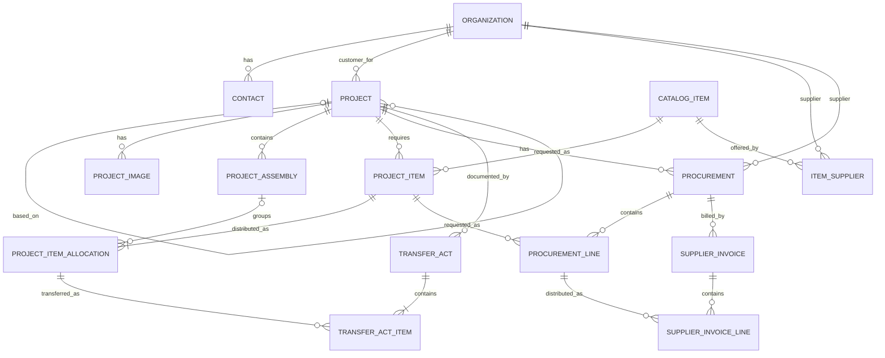

# Черновая модель предметной области EngFlow

Статус: текущая согласованная модель. Поля предварительные; нерешенные вопросы отмечены `TODO / Open Question`.

## 1. ER-диаграмма

Диаграмма не вводит сущности ролей, файлового хранилища, поступлений, склада, писем или учета времени.

## 2. Project

**Назначение:** одна конструкция/установка по одной КД и одному заказу. Несколько физических экземпляров учитываются количеством.

Поля: `id`, `designation` (обязательное, уникальное), `name`, `modificationName`, `customer -> Organization`, `status`, `quantity`, `completionDate` (nullable), `description`, `basedOnProject -> Project` (nullable), `createdAt`, `updatedAt`.

Статусы: `DESIGN`, `PRODUCTION`, `COMPLETED`.

Связи:

- `Organization 1:N Project`: организация является заказчиком нескольких проектов; у проекта один заказчик.
- Самоссылка `Project 1:N Project`: исходный проект может быть основой нескольких новых; у нового проекта не более одного `basedOnProject`.
- `Project 1:N ProjectImage`, `ProjectAssembly`, `ProjectItem`, `Procurement`, `TransferAct`.

Правила:

- Используется `modificationName`, не `modelName`.
- `completionDate` — фактическая дата завершения; до завершения равна `NULL`. Отдельное `plannedCompletionDate` пока не вводится.
- Год выводится из `completionDate` и отдельно не хранится.
- `designation` обязательно и уникально; жесткая валидация формата пока отсутствует.
- `basedOnProject` означает происхождение и возможное копирование; проекты не синхронизируются после создания. Закупки, счета, будущие поступления и `completionDate` динамически не наследуются.

`TODO / Open Question`: обязательность заказчика, нормализация обозначения, ограничения количества и точный состав копируемых данных.

## 3. ProjectImage

**Назначение:** метаданные фотографии проекта.

Поля: `id`, `project -> Project`, `originalFileName`, `storageName`, `description`, `isPrimary`, `sortOrder`.

Связь: `Project 1:N ProjectImage`; фотография принадлежит одному проекту.

Правила: изображение не хранится в PostgreSQL как BLOB; `storageName` является идентификатором/путем отдельного переносимого файлового хранилища, не абсолютным пользовательским Windows-путем.

`TODO / Open Question`: единственность основной фотографии, форматы, размеры, удаление файлов и точная семантика `storageName`.

## 4. Organization

**Назначение:** единая организация-заказчик и/или поставщик.

Поля: `id`, `name`, `shortName`, `inn`, `kpp`, `ogrn`, `legalAddress`, `postalAddress`, `website`, `notes`, `createdAt`, `updatedAt`; роли `CUSTOMER`, `SUPPLIER`.

Связи: `Organization 1:N Contact`, `Project` (как заказчик), `ItemSupplier` и `Procurement` (как поставщик).

Правила: организация хранит набор ролей и может одновременно иметь `CUSTOMER` и `SUPPLIER`; значение `BOTH` не используется; отдельные `Customer` и `Supplier` не создаются.

`TODO / Open Question`: обязательность и уникальность реквизитов, поддержка иностранных организаций.

## 5. Contact

**Назначение:** контакт организации для коммуникаций, будущих запросов и писем.

Поля: `id`, `organization -> Organization`, `fullName`, `position`, `email`, `phone`, `isPrimary`, `notes`.

Связь: `Organization 1:N Contact`; контакт принадлежит одной организации.

`TODO / Open Question`: единственность основного контакта, обязательность и валидация email/телефона.

## 6. CatalogItem

**Назначение:** позиция общего каталога ранее использованных покупных изделий.

Поля: `id`, `designation`, `name`, `manufacturer`, `measurementUnit -> MeasurementUnit`, `notes`, `createdAt`, `updatedAt`.

Связи: `CatalogItem 1:N ItemSupplier`, `CatalogItem 1:N ProjectItem`; через `ItemSupplier` реализуется `CatalogItem N:M Organization`.

Правила: стандартные и прочие изделия находятся в одном каталоге; стандарт может быть частью обозначения/наименования; `designation` пока не уникально; единица обязательна и выбирается из справочника.

`TODO / Open Question`: определение дубликатов при неуникальном обозначении и представление производителя.

### 6.1. MeasurementUnit

**Назначение:** небольшой справочник допустимых единиц измерения.

Поля: `id`, `name` (уникальное обязательное отображаемое значение), `createdAt`, `updatedAt`.

Связь: `MeasurementUnit 1:N CatalogItem`.

Начальные значения: `шт.`, `мм`, `м`, `кг`, `г`, `л`, `компл.`. Существующая логика шага количества сохраняется по значению единицы.

## 7. ItemSupplier

**Назначение:** возможность приобретения изделия у конкретного поставщика.

Поля: `id`, `catalogItem -> CatalogItem`, `supplier -> Organization`, `supplierArticle` (nullable), `notes` (nullable), `createdAt`, `updatedAt`.

Связи: `CatalogItem 1:N ItemSupplier`; `Organization 1:N ItemSupplier`; вместе — связь `CatalogItem N:M Organization` с атрибутами. Пара `catalogItem + supplier` уникальна; `supplier` обязан иметь роль `SUPPLIER`.

Правила: организация выступает поставщиком; будущая рекомендация может опираться на исторически приобретенное количество и не ограничивает ручной выбор.

Tentative decision: пара `catalogItem + supplier` предполагается уникальной.

Типичный срок, URL, цены и прочие будущие сведения сейчас не добавляются.

`TODO / Open Question`: подтвердить tentative-ограничение пары изделие–поставщик с учетом возможных нескольких вариантов/артикулов одного поставщика.

## 8. ProjectAssembly

**Назначение:** условное верхнеуровневое функциональное разбиение установки для классификации комплектации, не полная структура КД. В UI используется термин «Раздел».

Поля: `id`, `project -> Project`, `name`, `designation` (nullable), `notes`.

Связи: `Project 1:N ProjectAssembly`; `ProjectAssembly 1:N ProjectSubsection`; необязательная связь с `ProjectItemAllocation`.

Правило: узлы в будущем могут копироваться в производный проект.

Примеры разделов: вакуумная система, газовая система, рама, система охлаждения, пневматика, электрическая часть. Назначение раздела для `ProjectItem` необязательно.

Внутри проекта очевидные дубли имени узла без учета регистра не допускаются; сложная нормализация названий не выполняется.

`TODO / Open Question`: нужна ли жесткая уникальность имени на уровне БД, сортировка узлов и состав копируемых данных.

### 8.1. ProjectSubsection

**Назначение:** необязательная детализация раздела для указания сборки/узла.

Поля: `id`, `projectAssembly -> ProjectAssembly`, `designation`, `createdAt`, `updatedAt`.

Связи: `ProjectAssembly 1:N ProjectSubsection`; `ProjectSubsection 1:N ProjectItemAllocation`.

Правила: designation обязателен; подраздел принадлежит ровно одному разделу; полная структура КД и сущность детали не моделируются. `appliesFor` не является свойством подраздела.

## 9. ProjectItem

**Назначение:** потребность конкретного проекта в покупном изделии, не заказ.

Поля: `id`, `project -> Project`, `catalogItem -> CatalogItem`, `notes`, `createdAt`, `updatedAt`. `requiredQuantity` — вычисляемая сумма allocations, не отдельная колонка.

Связи: `Project 1:N ProjectItem`; `CatalogItem 1:N ProjectItem`; `ProjectItem 1:N ProjectItemAllocation`; `ProjectItem 1:N ProcurementLine`.

Правила:

- поставщик не является обязательным свойством;
- потребность делится между несколькими заказами/поставщиками;
- в одном проекте пара `project + catalogItem` уникальна;
- `requiredQuantity` вычисляется как сумма дробных quantities allocations;
- отдельного поля единицы нет; `requiredQuantity` использует единицу связанного `CatalogItem`.
- `requiredQuantity` автоматически не умножается на количество физических экземпляров `Project.quantity`.
- В UI список потребностей называется «Комплектация»; порядковый номер строки вычисляется при отображении и не является полем модели.
- Поиск/autocomplete каталога и создание новой позиции на основе существующей являются UI-операциями и не меняют связи модели.

`TODO / Open Question`: будущая семантика `requiredQuantity` относительно `Project.quantity`, изменение потребности после заказа, учет собственного наличия.

### 9.1. ProjectItemAllocation

**Назначение:** распределяет количество агрегированной позиции комплектации по разделу проекта.

Поля: `id`, `projectItem -> ProjectItem`, `projectAssembly -> ProjectAssembly` (nullable), `projectSubsection -> ProjectSubsection` (nullable), `appliesFor` (nullable), `quantity`, `notes`, `createdAt`, `updatedAt`.

Связи: `ProjectItem 1:N ProjectItemAllocation`; необязательная `ProjectAssembly 1:N ProjectItemAllocation`; `ProjectItemAllocation 1:N TransferActItem`.

Правила: quantity — положительный `BigDecimal` с шагом единицы `CatalogItem`; отсутствие раздела означает «Без раздела»; общая потребность родителя равна сумме allocations. Подраздел необязателен и при наличии обязан принадлежать выбранному разделу. `appliesFor` — свободный текст и не обязан соответствовать подразделу. Без подраздела для одного section разрешена одна строка. При наличии подраздела уникальна комбинация `section + subsection + appliesFor`; один subsection может иметь несколько строк с разным `appliesFor`.

## 10. Procurement

**Назначение:** закупочный процесс у конкретного поставщика в рамках одного проекта.

Поля: `id`, `project -> Project`, `supplier -> Organization`, `rfqSentAt` (nullable), `notes` (nullable), `createdAt`, `updatedAt`.

Связи: `Project 1:N Procurement`; `Organization 1:N Procurement`; `Procurement 1:N ProcurementLine`; `Procurement 1:N SupplierInvoice`.

Правила: supplier обязан иметь роль `SUPPLIER`; один поставщик может иметь несколько Procurement одного проекта; `rfqSentAt != NULL` фиксирует факт отправки запроса без email-автоматизации.

`TODO / Open Question`: отмена/повторная отправка RFQ, ручная корректировка даты и жизненный цикл закупки.

## 11. ProcurementLine

**Назначение:** количество конкретной проектной потребности, запрошенное у поставщика в рамках Procurement.

Поля: `id`, `procurement -> Procurement`, `projectItem -> ProjectItem`, `requestedQuantity`, `notes` (nullable), `createdAt`, `updatedAt`.

Связи: `Procurement 1:N ProcurementLine`; `ProjectItem 1:N ProcurementLine`; `ProcurementLine 1:N SupplierInvoiceLine`.

Правила: ProjectItem принадлежит проекту Procurement; количество положительное и дробное; пара `procurement + projectItem` уникальна; одна потребность может находиться в Procurement нескольких поставщиков; суммарно запрошенное количество по всем поставщикам не превышает `requiredQuantity`.

## 12. SupplierInvoice

**Назначение:** счет поставщика в рамках Procurement; сам факт его получения еще не означает размещенный заказ.

Поля: `id`, `procurement -> Procurement`, `invoiceNumber`, `invoiceDate`, `paymentSubmittedDate` (nullable), `fileOriginalName` (nullable), `fileStorageName` (nullable), `fileContentType` (nullable), `notes` (nullable), `createdAt`, `updatedAt`.

Связи: `Procurement 1:N SupplierInvoice`; `SupplierInvoice 1:N SupplierInvoiceLine`.

Правила: действие «Передать в оплату» устанавливает `paymentSubmittedDate`; только после этого количества строк счета считаются заказанными. Файл хранится в файловой системе, БД содержит метаданные и безопасное имя хранения; поддерживаются PDF, изображения, XLS/XLSX, замена и удаление.

`TODO / Open Question`: отмена передачи в оплату, ручная дата, валюты, НДС, итоги и жизненный цикл файла/счета.

## 13. SupplierInvoiceLine и производные показатели

**Назначение:** распределяет часть `ProcurementLine` в конкретный счет.

Поля: `id`, `supplierInvoice -> SupplierInvoice`, `procurementLine -> ProcurementLine`, `quantity`, `unitPrice` (nullable), `notes` (nullable).

Связи: `SupplierInvoice 1:N SupplierInvoiceLine`; `ProcurementLine 1:N SupplierInvoiceLine`.

Правила: обе родительские сущности принадлежат одной Procurement; количество положительное и дробное; пара `supplierInvoice + procurementLine` уникальна; сумма количества по всем счетам строки не превышает `requestedQuantity`.

Производные показатели `ProjectItem`:

- `requestedQuantity` — сумма `ProcurementLine.requestedQuantity` по всем поставщикам;
- `orderedQuantity` — сумма `SupplierInvoiceLine.quantity` по всем поставщикам и счетам только при `paymentSubmittedDate != NULL`;
- без ProcurementLine статус `NOT_REQUESTED`; при отправленном RFQ и нулевом ordered — `RFQ_SENT`; при ordered > 0 — `ORDER_PLACED`;
- частичное покрытие не создает `PARTIALLY_ORDERED`, а отображается как `ordered / required`;
- `PARTIALLY_RECEIVED`, `RECEIVED`, `IN_STOCK` зарезервированы, но до появления фактических данных не вычисляются.

`TODO / Open Question`: поступления, склад, возвраты, перепоставка, изменение потребности и отмена/изменение заказа.

## 14. TransferAct

**Назначение:** документирует передачу выбранных позиций комплектации одного проекта в цех.

Поля: `id`, `number`, `year`, `actDate`, `project -> Project`, `deliveredBy`, `receivedBy`, `notes`, `transferred`, `createdAt`.

Связи: `Project 1:N TransferAct`; `TransferAct 1:N TransferActItem`.

Правила: пользователь не вводит номер; сервис назначает его последовательно в пределах года и отображает как `N/YYYY`; пара `year + number` уникальна. Для выдачи номера используется отдельный технический годовой счетчик с транзакционной блокировкой, а не `max(number) + 1`. Новый акт имеет состояние черновика (`transferred = false`) и может быть отредактирован или удален. После подтверждения (`transferred = true`) акт и строки неизменяемы и неудаляемы. Пустой черновик допустим, но подтвердить его нельзя. Первая версия предоставляет HTML-представление без PDF.

`TODO / Open Question`: аннулирование или исправление подтвержденных актов; пропуски номеров после отката/аннулирования; стратегия первичного создания годового счетчика при нескольких экземплярах приложения; расширение акта на позиции производства, не связанные с `ProjectItem`.

## 15. TransferActItem

**Назначение:** количество конкретной проектной потребности, переданное по акту в указанную конечную сборку/место применения.

Поля: `id`, `transferAct -> TransferAct`, `projectItemAllocation -> ProjectItemAllocation`, `destinationDesignation`, `appliesFor`, `shopNumber`, `quantity`, `notes`.

Связи: `TransferAct 1:N TransferActItem`; `ProjectItemAllocation 1:N TransferActItem`. Allocations одного CatalogItem могут встречаться в акте несколькими строками.

Правила:

- `quantity` — положительное дробное число (`BigDecimal`);
- выбрать для акта можно только allocation с подразделом;
- `destinationDesignation` и `appliesFor` — независимые исторические snapshot-значения, заполняемые соответственно из подраздела и allocation при создании строки;
- обозначение и наименование изделия не дублируются и читаются по цепочке `TransferActItem -> ProjectItemAllocation -> ProjectItem -> CatalogItem`;
- `transferredQuantity` для `ProjectItem` вычисляется как сумма `quantity` связанных `TransferActItem` только из подтвержденных актов и отдельно не хранится; черновики на расчет не влияют;
- передача сверх `ProjectItem.requiredQuantity` в первой версии запрещена валидацией;
- `totalSameCatalogItem` вычисляется для отображения как сумма количества того же `CatalogItem` внутри текущего акта и не хранится.

`TODO / Open Question`: допустимые сценарии осознанной сверхпередачи; влияние аннулированных актов после появления расширенного жизненного цикла документов.

## 16. Производные показатели передачи

- Передано по потребности: сумма `TransferActItem.quantity` для конкретного `ProjectItem` в подтвержденных актах.
- Остаток к передаче: `ProjectItem.requiredQuantity - transferredQuantity`.
- «Всего» в строке акта: сумма `TransferActItem.quantity` по одинаковому `CatalogItem` в пределах одного `TransferAct`.

## 17. Намеренно не зафиксированные сущности

Поля и связи следующих областей пока не согласованы, поэтому они не включены в ER-диаграмму:

- склад и распределение собственного наличия (возможное направление `WarehouseAllocation`);
- поступления и приемка (`Receipt`/`GoodsReceipt`);
- официальные письма (`OfficialLetter`);
- учет времени (возможное направление `WorkLog`, только после анализа `hours_meter`);
- пользователи и роли доступа.

Названия в скобках — рабочие ориентиры из требований, а не утвержденные сущности.
